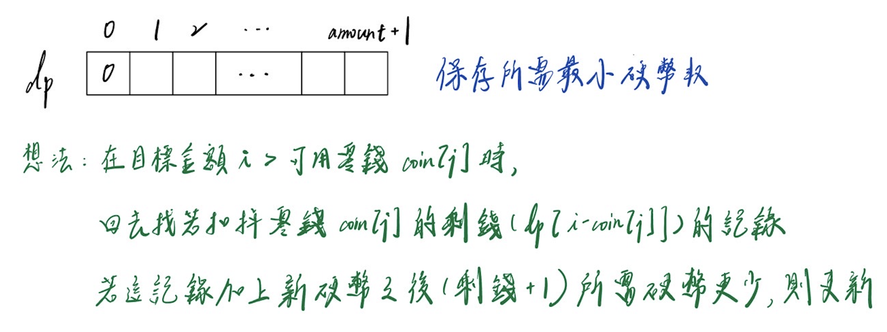

# 參考網站  
## 刷題順序
https://www.teamblind.com/post/New-Year-Gift---Curated-List-of-Top-75-LeetCode-Questions-to-Save-Your-Time-OaM1orEU
## 相關心得
https://github.com/yuan-luo/LeetCode  
https://github.com/youngyangyang04/leetcode-master  


# 時間紀錄
&#10006; 表示沒寫出來  
20240720
- 第377題 &#10006;
```c
// 要記得先做類型轉換(unsigned int *)malloc
// malloc 函數返回的是 void* 類型的指針
unsigned int *dp = (unsigned int *)malloc((target + 1) * sizeof(unsigned int));
```

- 第198題
```c
// 動態規劃
```

- 第213題 &#10006;
```c
// 198的延伸(當房屋環形排列的情況)
```

20240717
- 第139題 &#10006;
```c
// 字串處理以及動態規劃
```

20240715
- 第300題
```c
// 當前解法時間複雜度是O(n^2)
// 虽然这个解决方案已经可以有效地解决问题，
// 但还有更高效的方法可以将时间复杂度降低到 O(nlogn)，
// 即使用二分查找（Binary Search）和动态规划相结合的方法。
// 这种方法通常称为“Patience Sorting”。(by ChatGPT)
```

20240714
- 第268題
```c
// 使用qsort進行排序，再找出缺失的值
// 有更好的方法，EX.使用求和公式
```

- 第190題
```c
// 注意資料儲存方法要用 uint32_t
// 不要使用 pow() 會比較慢(by ChatGPT)
```

- 第70題
- 學習動態規劃  
https://medium.com/技術筆記/演算法筆記系列-dynamic-programming-動態規劃-de980ca4a2d3
```c
// 感覺空間可以更少
```

- 第322題 &#10006;
```c
// 使用 Greedy ALG 
// 可能不會找到最優解甚至是無解
// 例子说明问题
// 例如，假设硬币面值为 [1, 3, 4]，目标金额为 6。
// 贪心算法会选择面值最大的硬币 4，然后剩下 2，
// 再选择两个 1，共需要3枚硬币。
// 而实际的最优解是选择两个 3，共需要2枚硬币。 (by ChatGPT)
// 要使用動態規劃
int compare(const void *a, const void *b){
    return (*(int*)a - *(int*)b);
}
int coinChange(int* coins, int coinsSize, int amount) {
    if(amount == 0) return 0;

    qsort(coins, coinsSize, sizeof(int), compare);
    int coin_count = 0;
    for(int i = coinsSize - 1; i > -1; i--){
        while(amount >= coins[i]){
            amount -= coins[i];
            coin_count ++;
        }
    }
    if(amount == 0) return coin_count;
    else return -1;
}
```


20240713
- 第121題
```c
int maxProfit(int* prices, int pricesSize) {
    int max_profit = 0;

    // 兩個迴圈找最大值
    for(int i = 0; i < pricesSize - 1; i++){
        for(int j = i + 1; j < pricesSize; j++){
            if(prices[j] - prices[i] > max_profit) max_profit = prices[j] - prices[i];
        }
    }

    return max_profit;
}
// 問題點 : 時間複雜度O(n^2)，n變大會炸開
// 優化後複雜度為O(n)
```

- 第217題
```c
//問題點 : 用雙迴圈也會有時間複雜度O(n^2) 的問題，n變大會炸開
//解法 : 先進行排序再比較
//使用標準庫裡面的 qsort，時間複雜度O(nlogn)
//可以對各種形式陣列進行比較，但是需要先自行定義compare
void qsort(void *base, size_t nitems, size_t size, int (*compare)(const void *, const void*))
// base: 指向待排序数组的第一个元素的指针。
// nitems: 数组中的元素数量。
// size: 数组中每个元素的大小（以字节为单位）。
// compare: 比较函数的指针，该函数用于比较两个元素。
// 比较函数应当返回一个整数，表示比较结果：
// 小于零：表示第一个元素小于第二个元素。
// 等于零：表示两个元素相等。
// 大于零：表示第一个元素大于第二个元素。
// https://www.runoob.com/cprogramming/c-function-qsort.html
```

- 第191題
```c
// 重點 : 十進制轉二進制的方法 
```

- 第338題
```c
// 第191題的延伸
```


20240712  
- 第67題
```c
// 三元運算
variable = (condition) ? statement1 : statement2;

// 記憶體分配
char *result = malloc(result_len * sizeof(char));

// string 最後加上'\0'
result[result_len - 1] = '\0';

// 地址往後移一位
else return result + 1;
```


